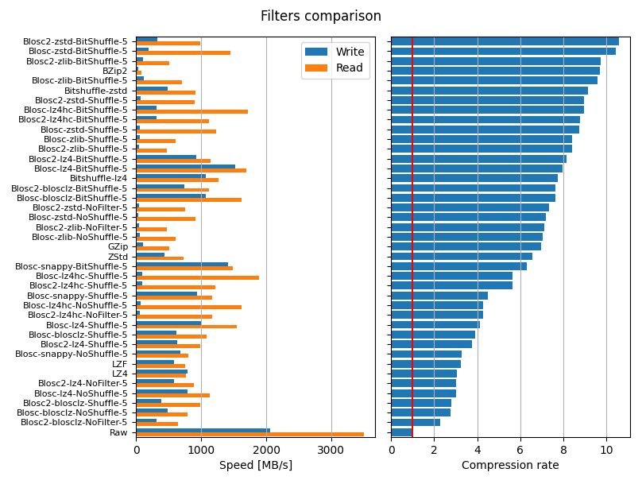
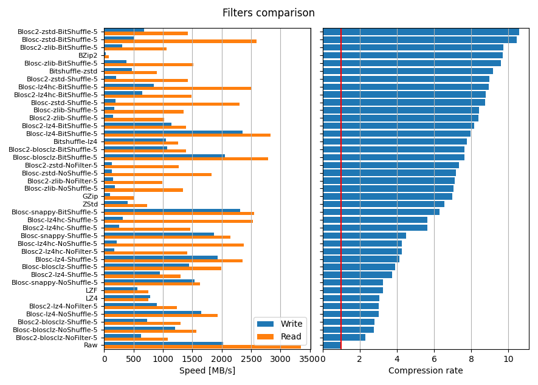

# Benchmarks

## How to run them?

First, install `uv`, then clone the repo with `git`, then `uv run python benchmark.py` will run the benchmarks on 1 CPU whereas `uv run python benchmark.py 4` will do so on 4 CPU's. In both cases, a file `benchmark.json` will be created in the current directory. Then `uv run jupyter lab benchmark.ipynb` will open a notebook that offers to display the results of the benchmarks with histograms.

## Some results

With 1 CPU,

With 4 CPU's,

Code and data from: https://www.silx.org/doc/hdf5plugin/latest/hdf5plugin_EuropeanHUG2023/benchmark.html